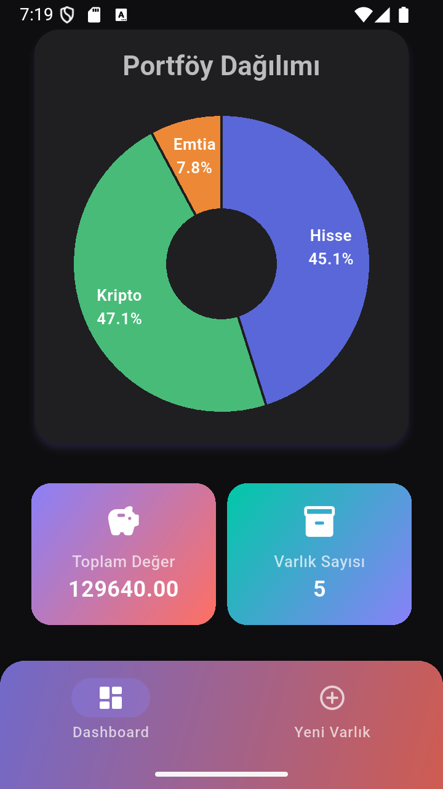
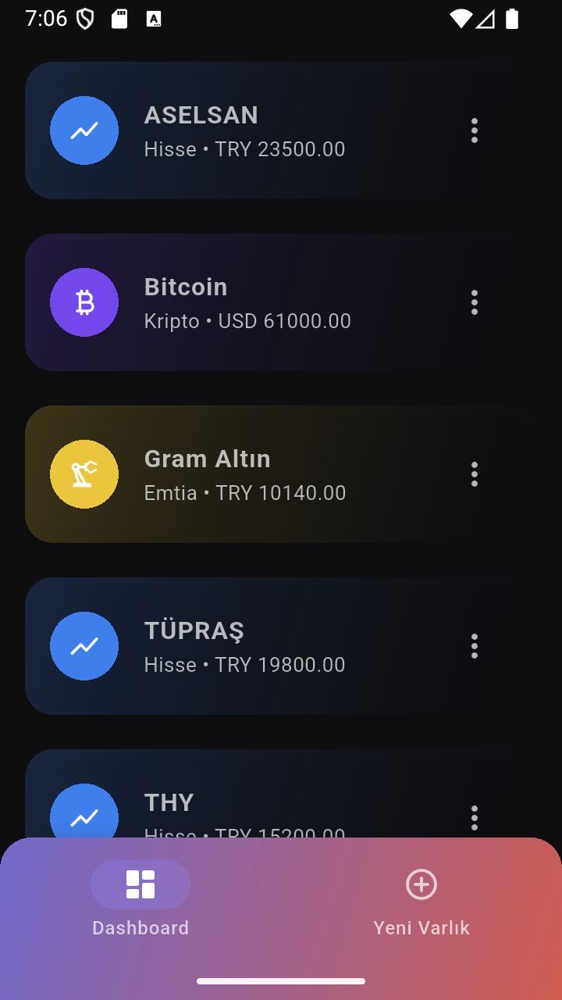
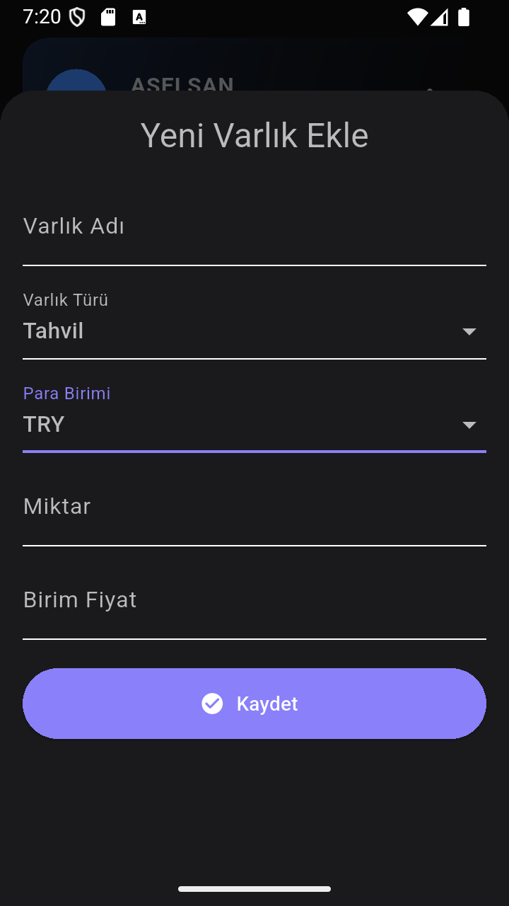
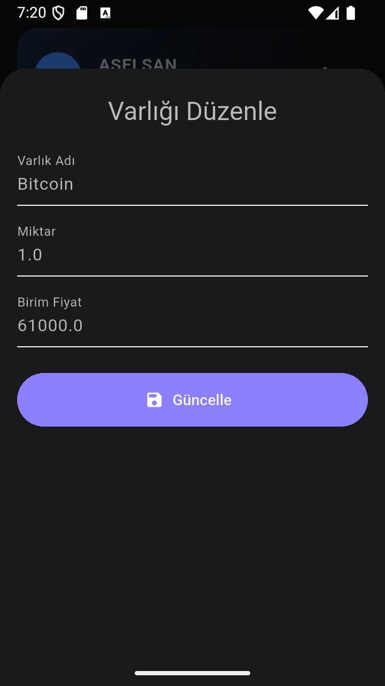

# 💼 Portföy Yönetim Sistemi v5.0

Bu proje, **Gazi Üniversitesi Bilgisayar Mühendisliği — Veritabanı Yönetim Sistemleri** dersi kapsamında geliştirilmiştir.  
Kullanıcıların yatırım portföylerini **merkezi bir sistem üzerinden yönetmesini** sağlayan bir uygulamadır.

Uygulama; hisse senetleri, kripto paralar, emtialar ve diğer varlık türlerini destekler.  
Kullanıcılar varlıklarını ekleyebilir, silebilir, düzenleyebilir ve portföy dağılımını grafiksel olarak analiz edebilir. 📊

---

## 🧱 Mimari Yapı

| Katman               | Teknolojiler                         |
| :------------------- | :----------------------------------- |
| **Frontend (Mobil)** | Flutter (Material 3, http, fl_chart) |
| **Backend (API)**    | Node.js + Express.js                 |
| **Veritabanı (DB)**  | PostgreSQL                           |
| **Araçlar**          | Postman, VSCode, Android Studio      |

---

## 🗄️ Veritabanı Yapısı

Yeni veritabanı ilişkisel şekilde tasarlanmıştır.  
Aşağıdaki tablolar birbirine **foreign key** bağlantıları ile bağlıdır:

| Tablo            | Açıklama                                            |
| :--------------- | :-------------------------------------------------- |
| **users**        | Kullanıcı bilgilerini tutar                         |
| **asset_types**  | Varlık türlerini (Hisse, Kripto, Emtia vb.) tutar   |
| **currencies**   | Para birimlerini (TRY, USD, EUR vb.) tutar          |
| **assets**       | Kullanıcıya ait tüm varlık kayıtlarını tutar        |
| **transactions** | (Hazırlıkta) Varlık alım-satım geçmişini saklayacak |

> 💡 Bu yapı sayesinde uygulama artık **çoklu kullanıcı, çoklu para birimi ve çoklu varlık türü** destekler hale gelmiştir.

---

## ⚙️ Backend Özellikleri

- 🔹 Express.js tabanlı RESTful API
- 🔹 PostgreSQL bağlantısı (pg Pool)
- 🔹 CRUD işlemleri:
  - **GET** → Tüm varlıkları / türleri / para birimlerini getirir
  - **POST** → Yeni varlık ekleme
  - **PUT** → Varlık düzenleme (yeni eklendi ✅)
  - **DELETE** → Varlık silme (bottom sheet içinden onaylı)
- 🔹 JOIN yapılarıyla ilişkisel veri çekimi
- 🔹 Dinamik varlık türü ve para birimi listeleri
- 🔹 JSON tabanlı cevap yapısı
- 🔹 Hatalar için gelişmiş try/catch loglama

---

## 📱 Frontend Özellikleri (v5.0)

- 🎨 Flutter (Material 3, dark/light theme desteği)
- 🔁 **Tam bottom sheet sistemi**:
  - “Yeni Varlık Ekle” formu artık sabit sayfa değil, **modal bottom sheet** olarak açılır
  - “Düzenle” işlemi de aynı şekilde **bottom sheet** üzerinden yapılır
  - “Sil” işlemi **onay dialog** ile yapılır
- 🧩 API ile tam CRUD senkronizasyonu
- 📊 **Gelişmiş Pie Chart**:
  - Her dilim içinde tür adı + yüzde oranı
  - Dokunulduğunda merkezde seçilen varlık türü, oranı ve toplam değeri
  - Modern pastel renk paleti ve animasyonlu geçişler
- 🔄 Gerçek zamanlı liste yenileme
- 💬 Snackbar ile işlem bildirimleri (ekleme, silme, düzenleme)
- 💡 Responsive, temiz, sade UI

---

## 🚀 Yeni Eklenenler (v5.0 Güncellemesi)

| Özellik                      | Açıklama                                                 |
| :--------------------------- | :------------------------------------------------------- |
| 🧩 **PUT Route (Backend)**   | Varlık güncelleme API’si eklendi (`/api/assets/:id`)     |
| 🗂️ **EditAssetSheet**        | Varlık düzenleme arayüzü eklendi (bottom sheet)          |
| ❌ **Delete Route**          | Silme işlemleri backend tarafında desteklendi            |
| 📊 **Modern Grafik**         | Pie chart içi etiketleme + merkez bilgi + animasyon      |
| 🔄 **Sayfa Yenileme**        | Ekleme/Düzenleme sonrası otomatik yenileme               |
| 💬 **Snackbar Bildirimleri** | Başarılı / Hata mesajları artık kullanıcıya gösteriliyor |
| 💡 **UI Düzenlemeleri**      | Karanlık temada renk kontrastları iyileştirildi          |

---

## 📸 Ekran Görüntüleri (v5.0)

<p align="center">
  
  
  
  
</p>

---

## 🧩 Klasör Yapısı

```
lib/
┣ core/
┃ ┣ constants/
┃ ┣ theme/
┃ ┗ widgets/
┣ data/
┃ ┣ api/api_service.dart
┃ ┗ models/asset_model.dart
┣ screens/
┃ ┣ home/
┃ ┣ add_asset/
┃ ┣ edit_asset/
┃ ┗ main_page.dart
┗ main.dart
```

---

## 👨‍💻 Geliştirici

**Harun Reşit Mercan**  
🎓 Gazi Üniversitesi — Bilgisayar Mühendisliği  
🌍 Flutter • Node.js • PostgreSQL Developer  
📬 [LinkedIn](https://linkedin.com/in/harunresitmercan) • [GitHub](https://github.com/HarunMercan1)
