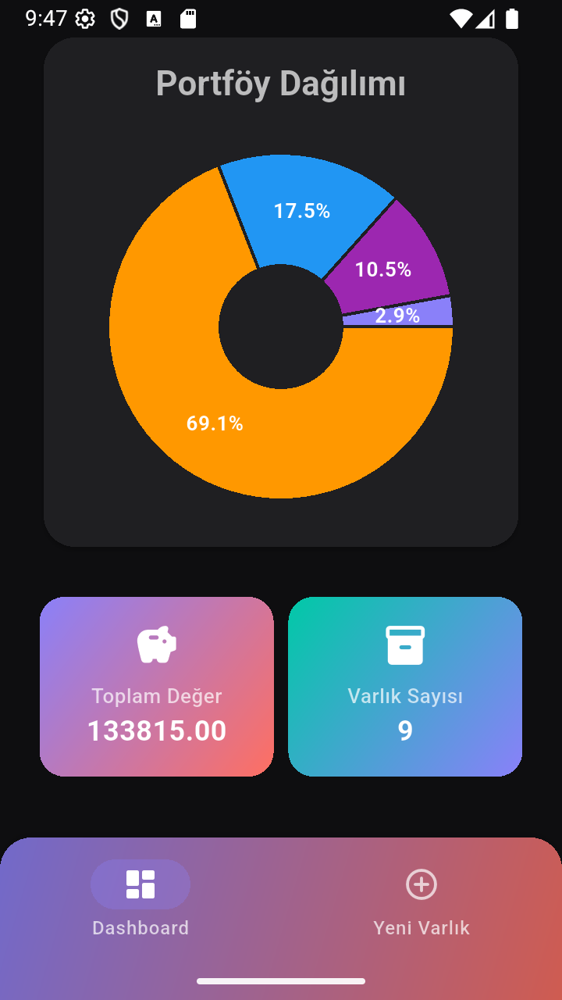
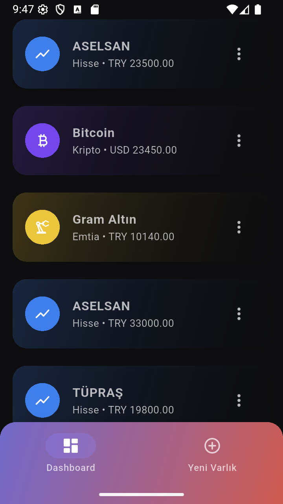
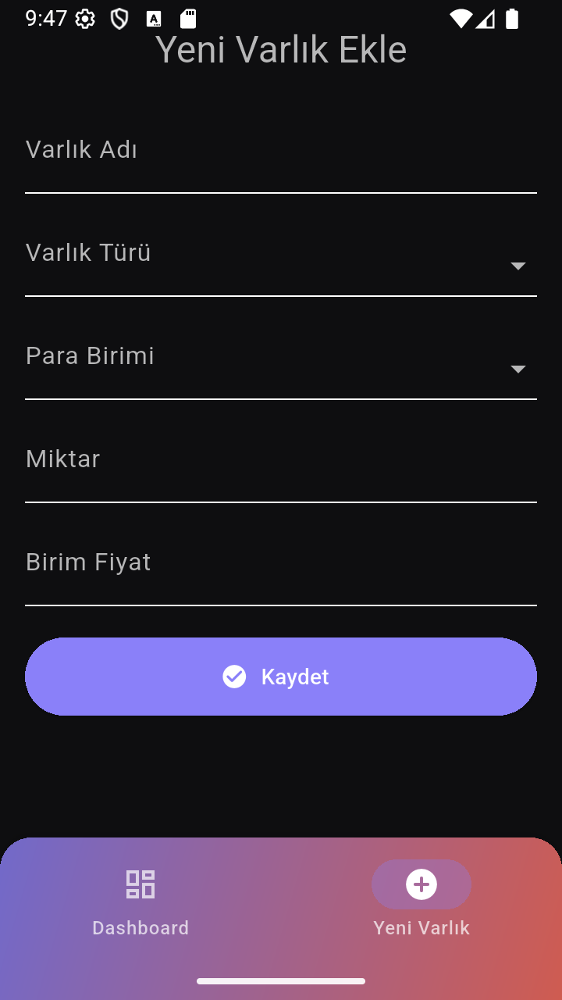

# 💼 Portföy Yönetim Sistemi

Bu proje, **Veritabanı Yönetim Sistemleri** dersi kapsamında geliştirilmiş bir **Portföy Yönetim Uygulamasıdır**.  
Kullanıcılar yatırım varlıklarını (örneğin altın, hisse senedi, kripto para vb.) görüntüleyebilir, ekleyebilir, güncelleyebilir ve silebilir.

---

## 🛠️ Teknolojiler

| Katman       | Teknolojiler                         |
| :----------- | :----------------------------------- |
| **Frontend** | Flutter (Material 3, fl_chart, http) |
| **Backend**  | Node.js, Express.js                  |
| **Database** | PostgreSQL                           |
| **Tools**    | Postman, VSCode, Android Studio      |

---

## 📸 Ekran Görüntüleri

  
  
  
  

## 🧩 Özellikler

- ✅ PostgreSQL veritabanı bağlantısı
- ✅ RESTful API (GET, POST, PUT, DELETE)
- ✅ Flutter arayüzü (modern, responsive)
- ✅ Pie chart ile portföy dağılımı
- ✅ Gerçek zamanlı veri yenileme
- 🔜 Varlık düzenleme (PUT) formu

---

👨‍💻 Geliştirici

Harun Reşit Mercan
📚 Gazi Üniversitesi - Bilgisayar Mühendisliği
