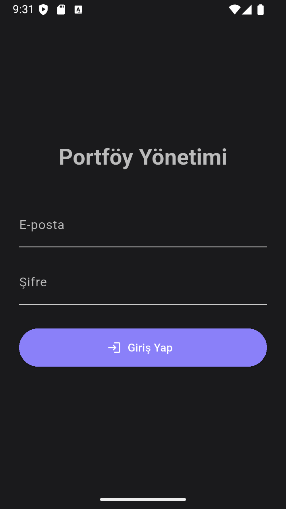
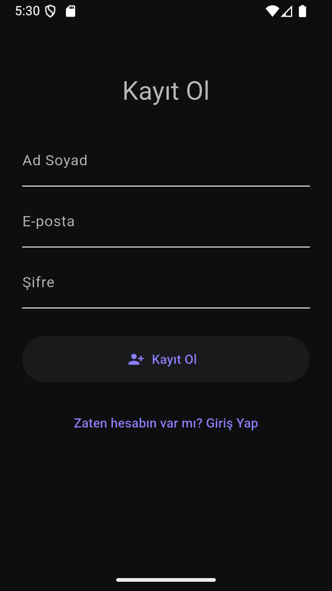
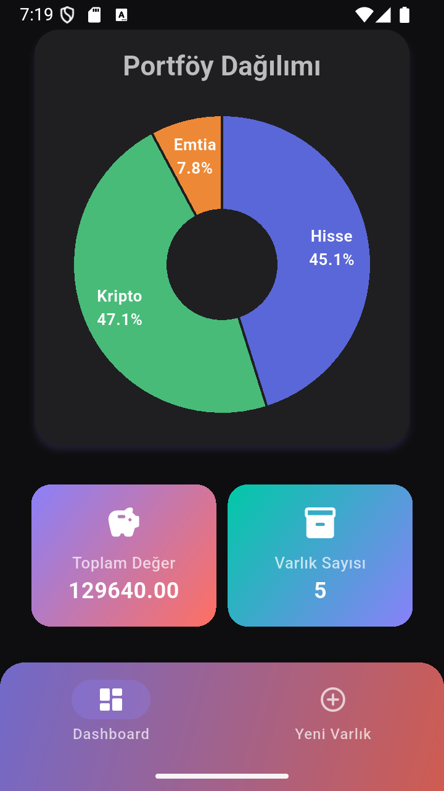
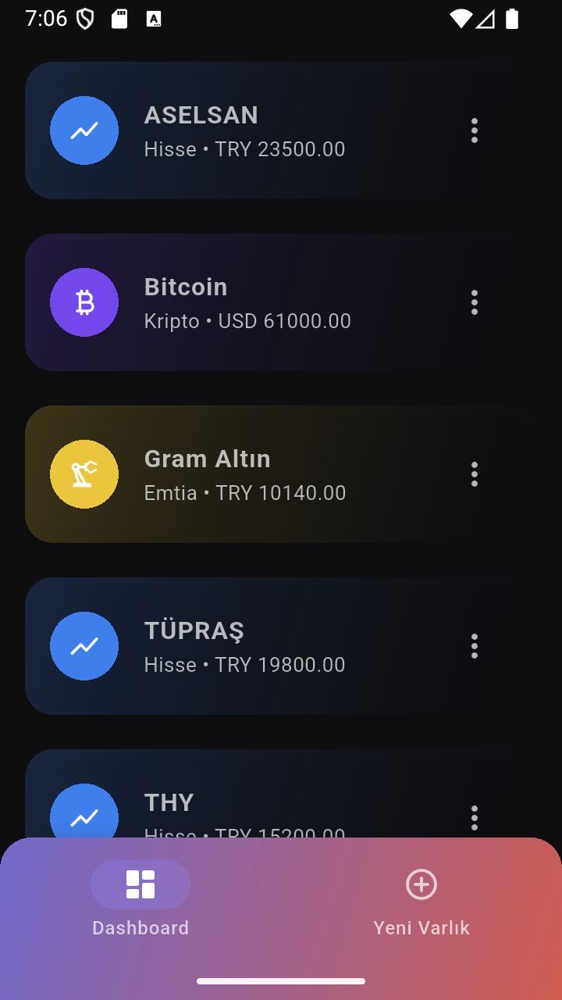
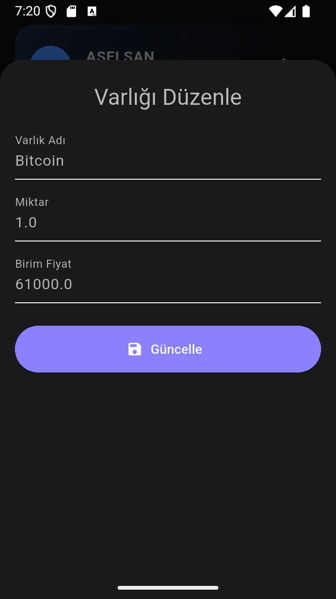
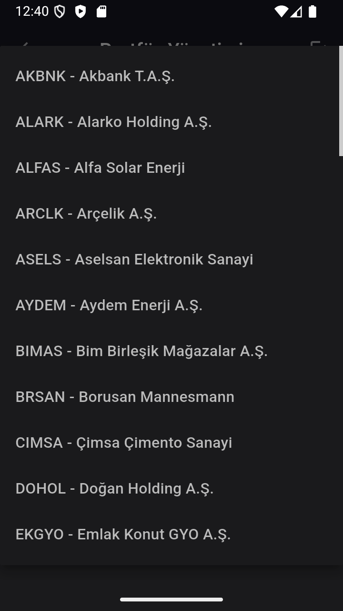

# 💼 Portföy Yönetim Sistemi v6.2

Bu proje, **Gazi Üniversitesi Bilgisayar Mühendisliği — Veritabanı Yönetim Sistemleri** dersi kapsamında geliştirilmiştir.  
Kullanıcıların yatırım portföylerini **kişisel hesapları üzerinden güvenli bir şekilde yönetmesini** sağlayan bir uygulamadır.

Artık her kullanıcı, sadece **kendi varlıklarını** görebilir, ekleyebilir, silebilir ve düzenleyebilir.  
JWT tabanlı kimlik doğrulama sayesinde tüm işlemler güvenli hale getirilmiştir. 🔐

---

## 🧱 Mimari Yapı

| Katman               | Teknolojiler                                         |
| :------------------- | :--------------------------------------------------- |
| **Frontend (Mobil)** | Flutter (Material 3, http, fl_chart, secure_storage) |
| **Backend (API)**    | Node.js + Express.js + JWT Authentication            |
| **Veritabanı (DB)**  | PostgreSQL                                           |
| **Araçlar**          | Postman, VSCode, Android Studio                      |

---

## 🗄️ Veritabanı Yapısı

Veritabanı ilişkisel olarak tasarlanmıştır ve **her varlık doğrudan bir kullanıcıya bağlıdır.**  
Aşağıdaki tablolar foreign key bağlantıları ile birbirine bağlıdır:

| Tablo            | Açıklama                                          |
| :--------------- | :------------------------------------------------ |
| **users**        | Kullanıcı bilgilerini ve kimlik bilgilerini tutar |
| **asset_types**  | Varlık türlerini (Hisse, Kripto, Emtia vb.) tutar |
| **currencies**   | Para birimlerini (TRY, USD, EUR vb.) tutar        |
| **assets**       | Her kullanıcının varlık kayıtlarını saklar        |
| **transactions** | (Hazırlıkta) Varlık alım-satım geçmişini tutacak  |

> 💡 Artık sistem **çoklu kullanıcı** desteğine sahiptir; her kullanıcı sadece kendi portföyünü görür.

---

## ⚙️ Backend Özellikleri

- 🔹 Express.js tabanlı RESTful API
- 🔹 PostgreSQL bağlantısı (pg Pool)
- 🔹 JWT tabanlı **kimlik doğrulama** (login / register / token doğrulama)
- 🔹 CRUD işlemleri:
  - **GET** → Giriş yapan kullanıcıya ait varlıkları getirir
  - **POST** → Yeni varlık ekleme (token’dan user_id alınır)
  - **PUT** → Varlık düzenleme
  - **DELETE** → Varlık silme
- 🔹 Her API isteğinde token doğrulama (`authMiddleware`)
- 🔹 `req.user.userId` üzerinden kullanıcıya özel sorgular
- 🔹 Gelişmiş hata yakalama ve loglama sistemi

---

## 📱 Frontend Özellikleri (v6.0)

- 🎨 Flutter (Material 3, dark/light theme desteği)
- 🔐 **Kullanıcı Girişi ve Oturum Yönetimi**
  - Login işlemi sonrası alınan JWT token **Flutter Secure Storage**’da saklanır
  - Her API isteğinde `Authorization: Bearer <token>` header’ı otomatik eklenir
  - Logout ile token güvenli şekilde silinir
- 🧩 CRUD İşlemleri
  - “Yeni Varlık Ekle” → modal bottom sheet üzerinden
  - “Düzenle” → **EditAssetSheet** üzerinden inline form
  - “Sil” → onay dialog ile
- 📊 **Modern Pie Chart**
  - Dilim içinde tür adı + yüzde oranı
  - Dokunulduğunda merkezde detay bilgisi (oran + toplam ₺)
  - Smooth animasyonlar ve modern renk paleti
- 🔄 Gerçek zamanlı yenileme (ekleme/düzenleme sonrası otomatik)
- 💬 Snackbar ile işlem geri bildirimleri
- 💡 Responsive ve sade arayüz

---

## 🚀 Yeni Eklenenler (v6.0 Güncellemesi)

| Özellik                        | Açıklama                                                           |
| :----------------------------- | :----------------------------------------------------------------- |
| 🔐 **JWT Authentication**      | Giriş yapan kullanıcıya özel token sistemi eklendi                 |
| 👤 **Kullanıcı Bazlı Portföy** | Her kullanıcı sadece kendi varlıklarını görebiliyor                |
| 🔑 **Secure Token Storage**    | Flutter Secure Storage ile token güvenli şekilde saklanıyor        |
| 🔁 **Header Entegrasyonu**     | Her istek otomatik olarak `Authorization` header’ı içeriyor        |
| 🧩 **Auth Middleware**         | Backend tarafında token doğrulama zorunlu hale getirildi           |
| 🧱 **Kod Refaktörü**           | assets.js, auth.js ve api_service.dart yapısı yeniden düzenlendi   |
| ⚙️ **Logout Özelliği**         | Kullanıcı çıkışı artık token’ı temizliyor ve Login’e yönlendiriyor |
| 🧠 **Tam Senkronizasyon**      | Flutter ↔ Node.js ↔ PostgreSQL arasında kullanıcı bazlı veri akışı |

---

## 📸 Ekran Görüntüleri (v6.0)

<p align="center">
  
  
  
  
  
  
  
</p>

## 🧩 Klasör Yapısı

```
lib/
┣ core/
┃ ┗ theme/
┃   ┗ app_theme.dart
┣ data/
┃ ┗ api/
┃   ┗ api_service.dart
┣ models/
┃ ┗ asset_model.dart
┣ screens/
┃ ┣ add_asset/
┃ ┃ ┗ add_asset_sheet.dart
┃ ┣ auth/
┃ ┃ ┗ login_screen.dart
┃ ┣ edit_asset/
┃ ┃ ┗ edit_asset_sheet.dart
┃ ┣ home/
┃ ┃ ┣ widgets/
┃ ┃ ┃ ┣ asset_card.dart
┃ ┃ ┃ ┣ portfolio_chart.dart
┃ ┃ ┃ ┗ summary_card.dart
┃ ┃ ┗ home_screen.dart
┃ ┗ main_page.dart
┗ main.dart

```

## 👨‍💻 Geliştirici

**Harun Reşit Mercan**  
🎓 Gazi Üniversitesi — Bilgisayar Mühendisliği  
🌍 Flutter Developer  
📬 [LinkedIn](https://linkedin.com/in/harunresitmercan) • [GitHub](https://github.com/HarunMercan1)
